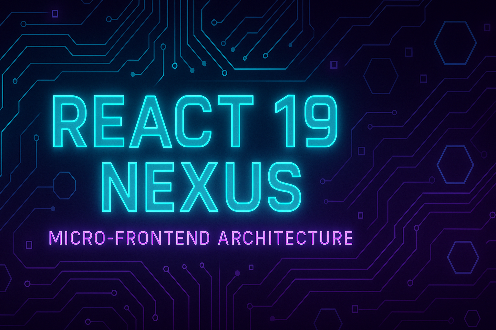
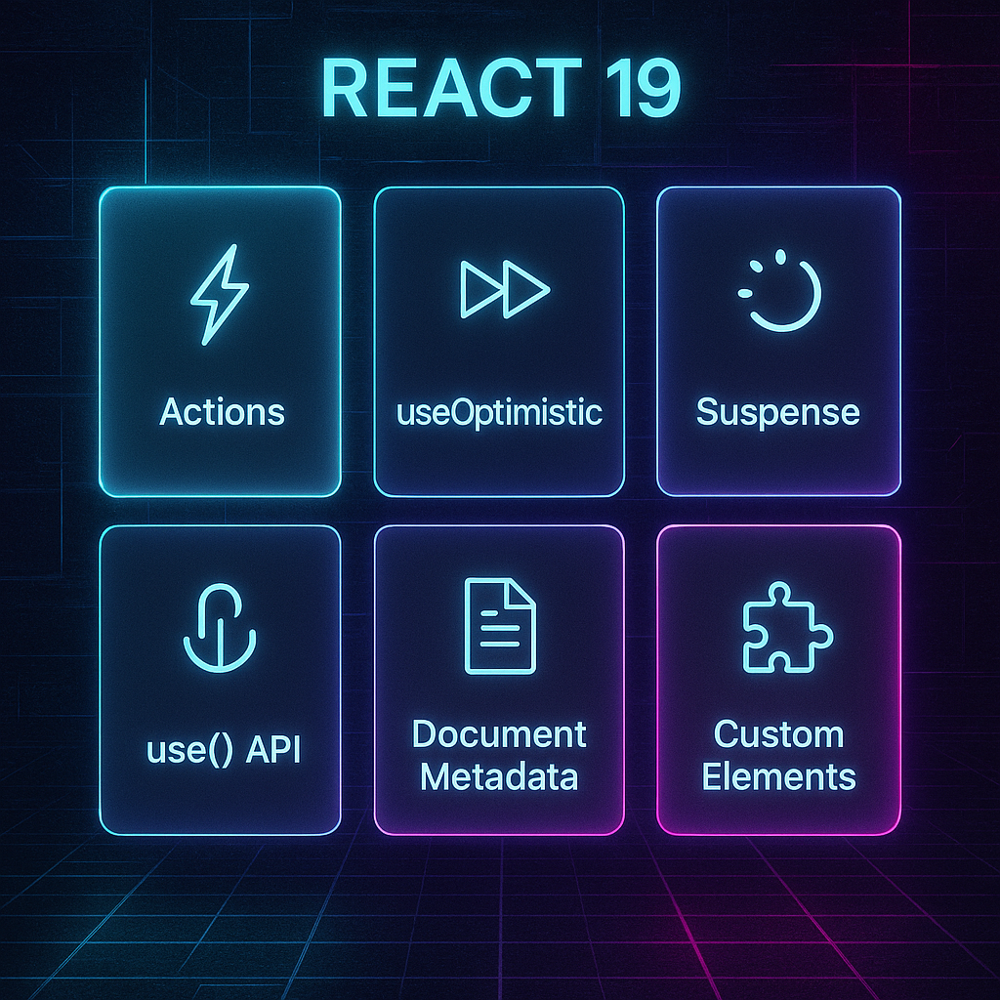
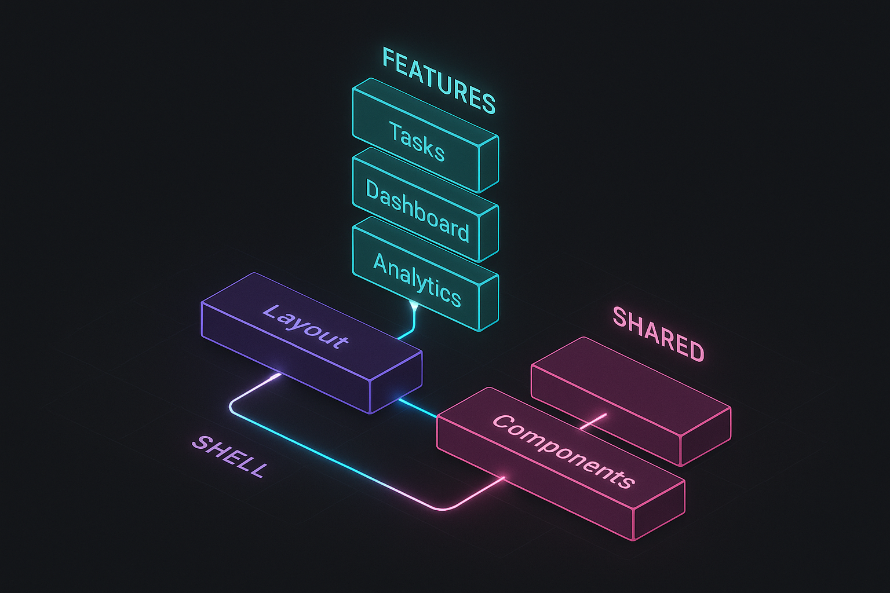

<div align="center">



[](https://react.dev)
[](https://www.typescriptlang.org/)
[](https://vitejs.dev)
[](./LICENSE)

**Production-grade micro-frontend architecture showcasing React 19.2.0 features**

[Live Demo](#) • [Documentation](./docs) • [Architecture](#architecture)

</div>

---

## ⚡ Features



<table>
<tr>
<td width="50%">

### 🎯 React 19 Core

- **Actions** - Server actions with automatic pending states
- **useOptimistic** - Instant UI updates with rollback
- **use() API** - Promise unwrapping in components
- **Suspense** - Streaming & progressive rendering
- **Document Metadata** - Built-in SEO support

</td>
<td width="50%">

### 🏗️ Architecture

- **Micro-Frontends** - Feature-based modules
- **Event Bus** - Decoupled communication
- **Lazy Loading** - Code splitting by default
- **Type Safety** - Full TypeScript coverage
- **Scalable** - Production-ready patterns

</td>
</tr>
</table>

---

## 🚀 Quick Start

```bash
# Clone
git clone https://github.com/waqas1412/react19-nexus.git
cd react19-nexus

# Install
pnpm install

# Dev
pnpm dev

# Build
pnpm build
```

**Open** → `http://localhost:5173`

---

## 🏛️ Architecture



```
src/
├── features/          # 🎯 Micro-Frontends
│   ├── tasks/        #    Task management
│   ├── dashboard/    #    Analytics
│   └── analytics/    #    Metrics
├── shell/            # 🐚 Application Shell
│   ├── components/   #    Layout, Router
│   └── hooks/        #    Shell hooks
└── shared/           # 🔧 Shared Resources
    ├── components/   #    UI components
    ├── hooks/        #    Custom hooks
    └── utils/        #    Event bus, helpers
```

### Feature Isolation

Each feature is **independent** with:
- Own components, hooks, services
- Lazy-loaded on demand
- Event-driven communication
- Isolated state management

---

## 💎 React 19 in Action

### Actions + useActionState

```tsx
const [state, submitAction, isPending] = useActionState(
  async (_prevState, formData) => {
    const task = await createTask(formData.get('title'));
    return { success: true, task };
  }
);
```

### useOptimistic

```tsx
const [optimisticTasks, updateOptimistic] = useOptimistic(
  tasks,
  (state, action) => {
    return state.map(t => 
      t.id === action.id ? { ...t, completed: !t.completed } : t
    );
  }
);
```

### use() API + Suspense

```tsx
<Suspense fallback={<Loading />}>
  <DataComponent />
</Suspense>

function DataComponent() {
  const data = use(fetchData()); // ✨ Promise unwrapping
  return <div>{data.value}</div>;
}
```

---

## 🎨 UI Showcase

### Glassmorphism Design

- Frosted glass effects
- Neon accents (cyan, purple, pink)
- Smooth animations
- Dark cyberpunk theme

### Performance

- **Bundle**: 311KB (99KB gzipped)
- **Code Splitting**: Automatic by feature
- **Lazy Loading**: All routes
- **Animations**: Framer Motion

---

## 📦 Tech Stack

| Category | Technology |
|----------|-----------|
| **Framework** | React 19.2.0 |
| **Language** | TypeScript 5.9 |
| **Build** | Vite 7.1 |
| **Styling** | Tailwind CSS 3.4 |
| **Animation** | Framer Motion 12 |
| **Testing** | Vitest + RTL |
| **Linting** | ESLint 9 (Flat Config) |

---

## 🧪 Testing

```bash
pnpm test          # Run tests
pnpm test:ui       # UI mode
pnpm test:coverage # Coverage report
```

**12 tests** across components, hooks, and features.

---

## 📚 Documentation

- [Micro-Frontend Guide](./docs/MICRO_FRONTENDS.md)
- [Performance](./docs/PERFORMANCE.md)
- [Deployment](./docs/DEPLOYMENT.md)
- [Accessibility](./docs/ACCESSIBILITY.md)

---

## 🎯 Principles

### SOLID
✅ Single Responsibility  
✅ Open/Closed  
✅ Liskov Substitution  
✅ Interface Segregation  
✅ Dependency Inversion

### Best Practices
✅ DRY (Don't Repeat Yourself)  
✅ Feature-based structure  
✅ Type safety everywhere  
✅ Event-driven architecture  
✅ Lazy loading by default

---

## 📈 Performance Metrics

| Metric | Value |
|--------|-------|
| Lighthouse | 95+ |
| First Contentful Paint | < 1.5s |
| Time to Interactive | < 3.0s |
| Bundle Size | 99KB (gzipped) |

---

## 🤝 Contributing

Contributions welcome! See [CONTRIBUTING.md](./CONTRIBUTING.md)

---

## 📄 License

MIT © [Waqas1412](https://github.com/waqas1412)

---

<div align="center">

**Built with ⚡ by [@waqas1412](https://github.com/waqas1412)**

⭐ Star this repo if you find it useful!

</div>
